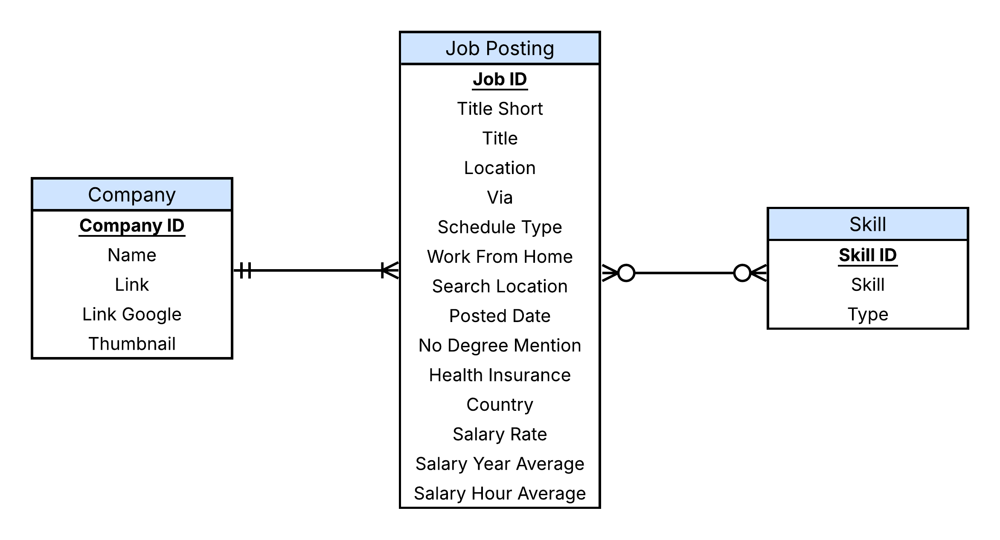
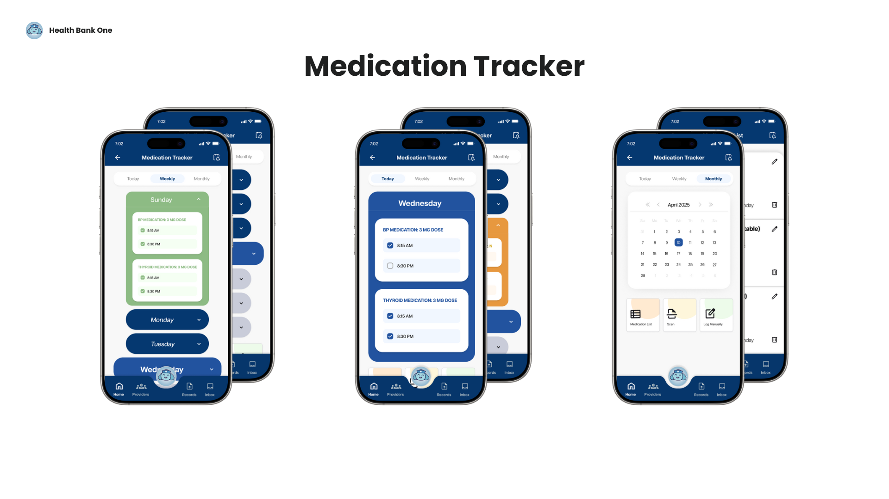

<h1>Hello, I'm Philip 👋 </h1> 

<h2>ℹ️ About</h2>

I’m a Master’s student at The University of Texas at Dallas, specializing in data analysis and aspiring to become a data engineer. I enjoy using Python, SQL, Excel, and visualization tools to explore datasets, uncover insights, and apply statistics to real-world problems.

<h2>👨🏻‍💻 Data Analysis/Science Projects</h2>

### U.S. Flight Delay Analysis - Excel (In Progress)
<!--[U.S. Flight Delay Analysis - Excel](https://github.com/FaiLuReH3Ro/excel-flight-delay-analysis)--> 
--- 
### Data Science Job Market Analysis - SQL

This project aims to deliver data-driven insights for job seekers pursuing Data Scientist roles in Texas. By utilizing **VS Code**, **PostgreSQL**, and complex **SQL** queries, I analyzed a dataset of job postings from 2023 to identify high-demand skills, high salaries, and significant differences between various job details.

> Check out the full project below

👉 [Data Science Job Market Analysis - SQL](https://github.com/FaiLuReH3Ro/sql-data-science-job-analysis)

---
### Data Insights for Tech Skills - Python

I utilized a subset of the 2024 Stack Overflow Developer Survey for this project to identify emerging in-demand tech skills. My approach involved using **data analysis** techniques in **Python** to identify current trends in programming skills, databases, and development tools.

> Check out the full project below

👉 [Data Insights for Tech Skills - Python](https://github.com/FaiLuReH3Ro/ibm-da-capstone-py)

---
### Stack Overflow Survey Dashboard - Plotly Dash

I developed a dashboard from scratch using the **Dash** framework, utilizing data from the *Data Insights for Tech Skills* project. By using **Python** programming and the **Plotly** library, I developed an interactive **web application** that showcases charts illustrating current technology trends, future trends, and demographic information.

> Check out information on the dashboard below

👉 [Stack Overflow Survey Dashboard - Plotly Dash](https://github.com/FaiLuReH3Ro/dev-survey-dashboard)

<!--
<h2>🖥️ Software Engineer Projects</h2>

Coming Soon...

-->

---

<h2>📱 UX Projects</h2>

### Health Bank One

This project aims to enhance the *Health Bank One* mobile app for women aged 40-65 who manage chronic conditions. My team decided to expand existing features and add new ones, including a Health Dashboard, Daily Health Log, Lab Reports, Trend Analysis, and Medication Tracker. The goal is to enhance user engagement by transforming the app from a medical record consolidation tool into a comprehensive health management platform. I analyzed the survey data using **Microsoft Excel**, utilizing **pivot tables** and **Power Query** to organize the information. To visualize the results, I created bar and pie charts. Additionally, I worked on the **Medication Tracker** feature and developed a prototype for it using **Figma**.

> Check out the full project below

👉 [Health Bank One Case Study](https://github.com/FaiLuReH3Ro/health-bank-one)

---
### Comet Focus

The goal of this project is to design a mobile app for students at The University of Texas at Dallas that addresses procrastination and helps them complete their schoolwork. I researched academic procrastination by utilizing **UX research methods** to design wireframes for a mobile app that tackles this issue. My process included **secondary research**, **interviews**, and a **competitive analysis** to gather valuable insights. After completing my research, I compiled the findings into a detailed report that included an **empathy map**, a **design persona**, and a **future-state user journey**.

> Check out the full project below

👉 [Comet Focus](https://github.com/FaiLuReH3Ro/comet-focus)

<h2>🔗 My Links</h2>

